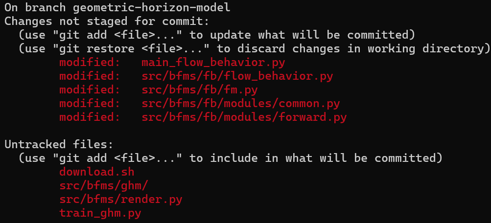
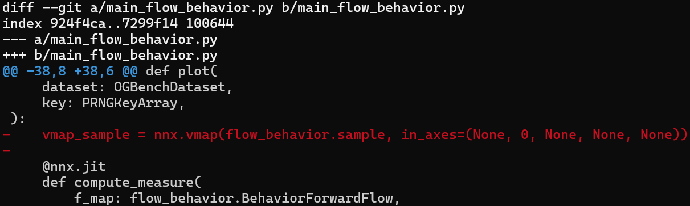
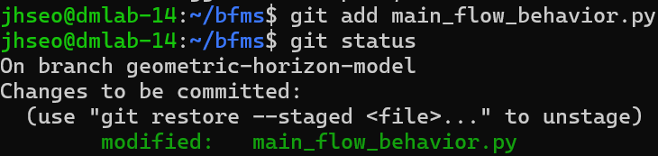
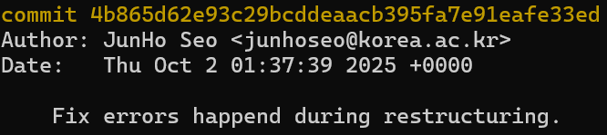
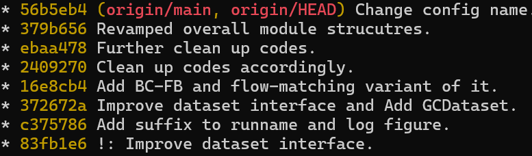
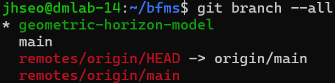
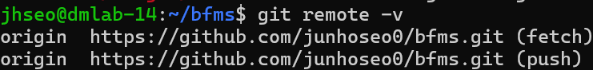

[Git](https://git-scm.com/)을 통해 협업을 진행하는 방법은 여러가지가 존재하지만, 우리는 가장 단순한 [Github Flow](https://docs.github.com/ko/get-started/using-github/github-flow)에 바탕을 둘 것입니다.

# Prerequisite: Git

Git의 형상 관리 모델에 대해 간략하게 설명을 진행합니다. 이미 Git을 잘 알고 있다면, 넘어가도 좋습니다. 반대로, Git에 대해 더 자세히 알고 싶다면 [Pro Git](https://git-scm.com/book/en/v2)을 추천합니다.

Git은 **브랜치** 기반 **분산** 형상 관리 도구입니다. 여기서 강조 표시한 두 부분이 기존의 형상 관리 도구(Tortoise SVN 등)와의 차별점입니다. 이때, "형상 관리"는 소스 코드의 변화 과정(형상)을 기록해, 언제든지 이전 버전으로 돌아갈 수 있도록 하는 것을 뜻합니다.

## 커밋(Commit)

Git에서 각 "형상"은 커밋(commit)을 통해 기록됩니다. 각 커밋(commit)은 이전 버전에서 발생한 변경 사항을 기록합니다. 예를 들어, 함수를 추가하거나, 삭제하거나, 혹은 함수의 시그니처(인자의 수, 타입 등)의 변경 등을 포함합니다.

Git에서, 각 파일은 세 가지 중 하나로 구분됩니다. Staged 파일, Tracked 파일, 그리고 Untracked 파일입니다. 이는 `git status` 명령어를 사용해 확인할 수 있습니다.



위 이미지에서, `main_flow_behavior.py`는 Git에서 추적(track)하는 파일, 즉, 형상이 관리되고 있는 파일이며, 마지막 커밋 이후로 수정이 발생했음을 알 수 있습니다. 마찬가지로, `download.sh`는 Untracked 파일로, Git에서 그 형상을 관리하지 않는 파일이라는 것도 알 수 있습니다.

`git diff <file name>` 명령어를 사용하면, 마지막 커밋 이후로 파일에 어떤 변경 사항이 발생하였는지를 확인할 수 있습니다.



이렇게 발생한 변경점을 `git add <file name>` 명령어를 통해 스테이지(stage)할 수 있습니다. 이는 커밋을 위해 파일을 준비함을 뜻합니다. 예를 들어, `git add`로 `main_flow_behavior.py` 파일을 추가하고, `git status` 명령어를 실행해 봅시다.



`main_flow_behavior.py` 파일이 커밋을 위해 준비된 것을 볼 수 있습니다. 실제로 이 변경사항을 커밋하기 위해서는, `git commit` 명령어를 사용합니다. 변경 사항들을 커밋할 때, 어떤 변경사항이 발생하였는지, 그리고 그 의도는 무엇인지를 기재해줍니다. 이를 커밋 메세지라 부릅니다.

커밋 메세지는 두 가지 방식으로 기재할 수 있습니다. 먼저, `git commit`을 아무 인자없이 호출하면, `git config --global core.editor`로 설정한 에디터가 실행됩니다. 따로 설정을 변경하지 않았다면, [nano](https://www.nano-editor.org/) 편집기가 실행될 가능성이 높습니다.


어떤 편집기를 사용하든, 커밋 메세지의 첫번째 문장은 해당 커밋의 변경 사항을 요약합니다. 이때, 이 문장은 보통 **명령형**으로 작성합니다. 예를 들어, 문서의 맞춤법을 수정하였다면, `I fixed spelling of README file.`이 아니라, `fix spelling of README file.`로 작성합니다. 이후, 한 문장을 띄운 뒤, 커밋의 구체적인 설명을 작성합니다. 이때, 실제 변경사항은 `git diff` 등을 사용해 쉽게 확인할 수 있으므로, 작성하는 내용은 "무엇"을 변경하였는지가 아니라, **"왜"** 변경하였는지를 기재합니다.

한편, 커밋 내용이 추가적인 설명이 필요 없을 정도로 자명할 수도 있습니다. 앞서 말한 문법 교정 같은 예가 그렇습니다. 이 경우, `-m` 옵션을 사용해 편집기를 실행하지 않고 간단하게 커밋을 남길 수 있습니다.
```bash
git commit -m 'Fix spelling of README file.'
```

이렇게 기록된 커밋은 고유번호(해시코드)가 부여되어, 기록됩니다.



위 이미지에서, `commit` 우측의 문자열이 해당 커밋을 고유하게 나타내는 해시 코드입니다. 그 밑에는 커밋을 작성한 저자와 날짜가 기록됩니다.

### 요약
Git은 변경 사항을 커밋이라는 단위로 기록합니다. 이에 따라, Git을 사용할 때 가장 기본적인 작업 순서는 다음과 같습니다.
1. 소스 코드를 수정한다.
2. 수정 사항을 `git add`로 스테이지한다.
3. 수정 사항을 `git commit`으로 커밋한다.

다음은 유용한 명령어를 모아놓은 것입니다.

| 명령어                                        | 설명                                                                 | 주의                          |
| ------------------------------------------ | ------------------------------------------------------------------ | --------------------------- |
| `git add -u`                               | 변경된 모든 추적하는 파일을 스테이지한다.                                            |                             |
| `git add .`                                | 변경되거나 추가된 모든 파일을 스테이지한다.                                           |                             |
| `git commit -m <message>`                  | 편집기를 열지 않고, 커밋 메세지를 작성한다.                                          |                             |
| `git commit --amend`                       | 현재 스테이지된 사항을 이전 커밋에 반영한다.<br>커밋 메세지를 수정하거나, 누락된 변경 사항을 반영할 때 사용한다. | 이미 `push`한 커밋은 절대 수정하지 말 것. |
| `git diff <file name>`                     | 이전 커밋과 비교해, 발생한 변경 사항을 출력한다.                                       |                             |
| `git diff --staged <file name>`            | 위와 동일하지만, 스테이지한 파일을 비교한다.                                          |                             |
| `git restore --staged <file name>`         | 스테이지한 파일을 "un-stage"한다.                                            |                             |
| `git config --global core.editor <editor>` | 커밋 메세지 작성에 사용할 편집기를 지정한다.                                          |                             |
| `git checkout HEAD -- <file name>`         | 해당 파일의 내용을 마지막에 커밋된 내용으로 되돌린다.                                     | 변경 사항이 모두 사라지니 주의.          |

## 브랜치(branch)
이렇게 기록된 커밋은 그래프처럼 연결되어, 하나의 브랜치(branch)를 구성합니다. 예를 들어,



해당 이미지는 8개의 커밋이 모여 `main` 브랜치를 구성하는 것을 보여줍니다. 아래로 갈수록 오래된 커밋, 위로 갈 수록 최근 커밋입니다.

브랜치라는 이름에서 유추할 수 있듯, 한 커밋에서 출발하여 다른 변경 사항으로 구성된 브랜치를 작성할 수 있습니다. 이를 "분기"라고 부릅니다.


위 그림은 커밋 C2에서 분기하여, 커밋 C4를 반영한 `main` 및 `hotfix` 브랜치와 커밋 C3를 반영한 iss53 브랜치의, 총 3개의 브랜치가 존재하는 것을 보여주고 있습니다.
브랜치는 개별 기능에 해당하는 변경 사항을 모두가 공유하는 `main` 브랜치로부터 격리하여, 발생할 수 있는 문제점을 예방해줍니다. 모든 사람이 같은 소스 코드를 동시에 변경한다면 얼마나 혼란스러울까요?

새로운 브랜치를 만들기 위해서는 다음 명령어를 사용합니다.

```bash
git branch <branch name> # 또는
git checkout -b <branch name>
```

위 명령어는 새로운 브랜치를 생성하기만 하지만, 아래 명령어는 해당 브랜치로 이동한다는 차이점이 존재합니다. 다른 브랜치로 이동하기 위해서는 다음 명령어를 사용합니다.

```bash
git switch <branch name> # 또는
git checkout <branch name>
```

이후에는 앞서 설명한 것처럼, 커밋을 남기면 됩니다.

### 브랜치 합치기

브랜치는 연관된 변경 사항을 별도로 격리해, 형상 관리를 용이하게 합니다. 하지만, 최종적으로 기능이 완성되면, 그 기능이 `main` 브랜치에 반영되어야 합니다. 이를 브랜치를 머지(merge)한다고 부릅니다. 머지는 다음 명령어를 통해 진행합니다.

```bash
git merge <source>
```

해당 명령어는 `<source>` 브랜치를 현재 위치한 브랜치로 머지합니다. 예를 들어, 기능을 완성하였고 `main` 브랜치에 반영하고 싶다면, 다음과 같이 명령어를 실행할 수 있습니다.

```bash
git switch main # main 브랜치로 이동.
git merge feat # feat 브랜치를 main 브랜치에 머지.
```

반대로, 기능을 아직 완성하지 않았지만, `main` 반영된 변경사항을 사용하고 싶은 경우에는, 반대로 진행할 수 있습니다.

```bash
git switch feat
git merge main # main 브랜치를 feat 브랜치에 머지.
```

머지가 끝나면, 두 브랜치의 변경 사항이 모두 반영된 머지 커밋이 생성됩니다. 이후, 더 이상 브랜치가 필요 없다면, 다음 명령어를 사용해 브랜치를 제거할 수 있습니다.

```bash
git branch -d <branch>
```

브랜치를 머지할 때, 두 브랜치의 변경 사항이 서로 충돌하지 않는다면 Git이 자동으로 두 브랜치를 병합해줍니다(이를 fast-forward라 부릅니다). 하지만, 두 변경 사항이 충돌할 수도 있습니다(예를 들어, 같은 파일의 같은 줄을 서로 다르게 수정한 경우 등). 이를 머지 충돌(merge conflict)라 부릅니다. 이 경우, 우리가 직접 두 변경 사항을 합친 후, 커밋을 새롭게 진행해야 합니다. 이는 문서로 간단하게 기술하기에는 어려움이 있어, 실제로 문제가 발생했을 때 다시 설명하도록 하겠습니다.

### 원격 브랜치와 지역 브랜치

앞서 말하였듯, Git은 분산 형상 관리 시스템입니다. 이는 곧 하나의 참인 레포지터리가 존재하지 않으며, 개인이 소유하고 있는 개별 레포지터리가 모두 올바른 레포지터리임을 뜻합니다[^1]. 이에 따라, 서로가 가지고 있는 레포지터리, 그리고 그 안의 브랜치들을 동기화할 필요가 있고, 이것이 Git에서는 `push`와 `pull` 명령어로 구현되어 있습니다.

분산 시스템에서, 브랜치는 크게 원격(remote) 브랜치와 지역(local) 브랜치로 구분합니다. 예를 들어, `git branch --all` 명령어를 사용해 브랜치 목록을 출력해 봅시다.



해당 이미지에서, "*"은 현재 브랜치를 뜻합니다. 이때, `remotes/`로 시작하는 브랜치가 원격 브랜치입니다. `origin/`은 원격 레포지터리의 이름입니다. 이는 `git remote -v` 명령어를 사용해 확인할 수 있습니다.



해당 이미지에서, `origin/` 브랜치가 Github이 관리하는 레포지터리를 나타내는 것을 알 수 있습니다[^2].

원격 브랜치에서 발생한 변경사항을 반영하기 위해서는 다음 명령어를 사용합니다.

```bash
git pull # 전체 브랜치를 pull. 또는,
git pull origin <branch> # origin에서 특정 브랜치를 pull.
```

개념적으로, `git pull`은 `git fetch && git merge`와 동일하지만, 이는 Git에 대한 이해가 더 높아진 후 생각해도 좋을 것 같습니다.

반대로, 로컬 브랜치에서 발생한 변경사항을 원격 브랜치에 반영하기 위해서는 다음 명령어를 사용합니다.

```bash
git push
```

### 요약

Git은 개별 기능을 별도의 브랜치로 구분해서 작업합니다. 일반적인 작업 순서는 다음과 같습니다.

1. 원하는 커밋에서 브랜치를 `git checkout -b` 명령어로 생성한다.
2. 변경 사항을 `git commit` 명령어로 커밋한다.
   공동 브랜치인 경우, 작업 시작 전 `git pull`로 원격 변경 사항을 먼저 반영한다.
3. 원격 브랜치로 변경 사항을 `git push`로 보낸다.

유용한 명령어들

| 명령어                                          | 설명                                | **주의**            |
| -------------------------------------------- | --------------------------------- | ----------------- |
| `git checkout -b <branch>`                   | 새로운 브랜치 생성                        |                   |
| `git push`                                   | 변경사항을 원격 브랜치에 반영.                 |                   |
| `git pull`                                   | 원격 브랜치의 변경사항을 지역 브랜치에 반영.         |                   |
| `git merge <source>`                         | `<source>` 브랜치의 변경사항을 현재 브랜치에 반영. |                   |
| `git branch -d`                              | 브랜치를 삭제.                          | 원격 브랜치는 삭제하지 말 것. |
| `git branch -v`                              | 지역 브랜치 목록을 출력.                    |                   |
| `git branch --remote -v`                     | 원격 브랜치 목록을 출력.                    |                   |
| `git log --all --decorate --oneline --graph` | 전체 브랜치의 커밋 기록을 출력.                |                   |
# Github Flow

Github Flow는 Git을 사용해 협업을 진행하는 여러 방법 중 가장 간단한 방법입니다. Github Flow에서 `main` (혹은 `master`) 브랜치는 항상 올바르게 동작하는 최신 프로그램을 담고 있다고 여겨집니다. 따라서, 새로운 기능을 추가할 때는 새로운 브랜치를 작성해 그 브랜치에서 작업을 진행합니다. 작업의 큰 흐름을 요약하면 다음과 같습니다.

1. `git checkout -b <branch_name>` 명령어로 새로운 브랜치를 작성한다.
   이때, 브랜치명은 보통 `이름/기능`으로 작성합니다. 예를 들어, `jhseo/constraints` 등.
2. 변경사항들을 커밋하고, 원격 브랜치에 `push`한다.
3. [Pull Reqeust](https://docs.github.com/en/pull-requests/collaborating-with-pull-requests/proposing-changes-to-your-work-with-pull-requests/about-pull-requests)를 남긴다.
4. 코드 리뷰를 받고, `main` 브랜치에 변경사항을 반영한다.
5. 반영된 브랜치를 삭제한다.

혼자서 작업할 때와 큰 차이점은 Pull Reqeust (PR)을 남긴다는 점입니다. PR은 메인 브랜치에 머지하기 전에, 공동 개발자들에게 사전 검수를 받는 과정입니다. 이후, 코드 리뷰에서 문제가 없으면, 변경 사항이 `main` 브랜치에 반영됩니다.

[^1]: 즉, 이 모델에서는 Github 또한 자신의 레포지터리를 가진 한 명의 사용자에 불과합니다.
[^2]: 유추할 수 있듯, 다른 사용자의 레포지터리도 원격으로 등록할 수 있습니다. 다만, 일반적이지는 않습니다.
