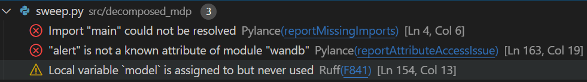

정적 체커(static checker)는 코드 실행 없이 코드를 분석하여 다양한 기능을 제공하는 툴을 의미합니다. 대표적으로, Visual Studio Code에서 파이썬 syntax highlighting 기능을 제공하는 Pylance 확장 프로그램도 정적 체커의 일종입니다. 본 문서에서 소개하는 정적 분석 툴은 포멧터(formatter), 린터(linter), 그리고 타입 체커(type checker)입니다.
# 포멧터(formatter)
공동 작업시 불필요한 코드 변경을 최소화하기 위해서 필요한 것은 동일한 코드 양식을 따르는 것입니다. 과거에는 [PEP8](https://peps.python.org/pep-0008/), [Google Python Style](https://google.github.io/styleguide/pyguide.html) 등 다양한 문서를 읽어가며 직접 양식을 맞췄어야 하지만, 현대에는 자동화된 포멧터(formatter)를 정해 자동으로 양식을 통일하고 있습니다. 저희는 [Ruff](https://docs.astral.sh/ruff/)라는 포멧터를 사용합니다.

Visual Studio Code를 사용하고 있다면, [Ruff Extension](https://marketplace.visualstudio.com/items?itemName=charliermarsh.ruff)을 사용해 파일을 저장할 때마다 자동으로 소스 코드를 포멧하도록 설정할 수 있습니다. 다음은 설정 파일입니다.
```json
{
	"[python]": {
		"editor.formatOnSave": true,
		"editor.defaultFormatter": "charliermarsh.ruff"
	}
}
```
현재 레포지터리에는 `.vscode/settings.json` 파일에 반영되어 있으니, 확장 프로그램만 설치하면 됩니다.

추가적인 포멧터 설정은 `pyproject.toml` 파일의 `[tool.ruff]` 단락에 기재합니다. 현재는 줄 길이를 88에서 100으로 늘리는 설정만 되어있습니다.
```toml
[tool.ruff]
line-length = 100
```
## 유용한 기능
의도적으로 리스트 포멧팅을 비활성화하고 싶으면, 마지막에 콤마(,)를 추가합니다.
```python
a = (
1,
2,
3, # leading comma disables formatting.
)
```

특정 줄에 포멧팅을 비활성화하고 싶으면, `fmt: skip`을 주석으로 추가합니다.
```python
a = call(
    [
        '1',  # fmt: skip
        '2',
    ],
    b
)
```

같은 주석을 전체 표현식(expression)을 비활성화하기 위해 사용할 수 있습니다.
```python
a = call(
    [
        '1',
        '2',
    ],
    b
) # fmt: skip
```

특정 구역의 포멧팅을 비활성화하고 싶으면, `fmt: off`와 `fmt: on`을 사용합니다.
```python
# fmt: off
not_formatted=3
also_not_formatted=4
# fmt: on
```
## pre-commit
[pre-commit](https://pre-commit.com/)은 변경 사항을 커밋할 때 사전에 지정한 테스트를 진행하는 훅(hook)입니다. 현재 설정된 프리 커밋은 `.pre-commit-config.yaml`에서 확인할 수 있습니다.
```yaml
repos:
- repo: https://github.com/pre-commit/pre-commit-hooks
    rev: v3.2.0
    hooks:
    -   id: trailing-whitespace
    -   id: end-of-file-fixer
    -   id: check-yaml
    -   id: check-added-large-files
- repo: https://github.com/astral-sh/ruff-pre-commit
  # Ruff version.
  rev: v0.14.5
  hooks:
    # Run the linter.
    - id: ruff-check
    # Run the formatter.
    - id: ruff-format
```
이는 커밋 전에,
- `trailing-whitespace`: 코드 줄 뒤의 불필요한 공백을 없애고,
- `end--of-file-fixer`: 코드 맨 마지막에 빈 줄을 추가하고,
- `check-yaml`: `yaml` 파일의 문법을 확인하며,
- `check-added-large-files`: 용량이 큰 파일이 실수로 스테이지되었는지 확인합니다.
또한,
- `ruff-check`: Ruff 린터를 실행하고,
- `ruff-format`: Ruff 포메터를 실행합니다.

pre-commit이 지정한 체크에 실패하면, 자동으로 파일을 수정합니다. 이후, 수정된 파일을 다시 스테이지하여 커밋하면 됩니다.
# 린터(linter)
포멧터가 코드의 생김새를 다듬는다면, 린터는 코드의 품질을 평가합니다. 예를 들어, 사용하지 않는 `import`가 존재하거나, `None`을 확인할 때 `is None` 대신 `== None`을 사용하는 등의 오류가 린터가 평가하는 내용입니다.


Ruff도 린터 기능을 제공하며, Ruff가 감지한 문제점은 Visual Studio Code의 Problems에 표기됩니다. 내용에 따라 수정 방식이 상이하니, 참고하셔서 수정하시면 됩니다.
# 타입 체커(type checker)
프로그래밍 언어는 타입을 어떻게 다루냐에 따라 정적 타입(static type) 언어와 동적 타입(dynamic type) 언어로 구분할 수 있습니다[^1]. 정적 타입 언어는 C언어처럼 변수마다 타입이 정해져있고, 타입에 해당하는 값만을 대입할 수 있는 언어를 뜻합니다. 동적 타입 언어는 반대로, 변수의 타입이 고정되어 있지 않고, 프로그램을 실행할 때 대입한 값에 따라 타입이 정해지는 언어를 뜻합니다. 파이썬은 동적 타입 언어에 해당합니다.

동적 타입 언어는 사용하기는 편하지만, 타입 불일치 등으로 발생하는 오류를 프로그램 실행 전에 확인할 수 없다는 단점이 존재합니다. 이에 따라, 파이썬도 [타입 힌트](https://docs.python.org/3/library/typing.html)라는 개념을 도입하였습니다. 타입 힌트는 함수 및 변수의 의도한 타입을 기재하는 것으로, 프로그램 실행시에는 영향을 미치지 않지만, 정적 타입 분석기가 이를 확인해 오류를 분석할 수 있습니다.

예를 들어, 원의 넓이를 구하는 함수를 작성해 봅시다.
```python
import math

def surface_area_of_circle(radius):
	return math.pi * r**2
```

타입 힌트를 추가하면, 다음과 같습니다.
```python
import math

def surface_area_of_circle(radius: float) -> float:
	return math.pi * r**2
```

이는 `surface_area_of_circle`이라는 함수가 실수를 인자로 받아, 실수를 반환함을 나타냅니다. 다음은 흔히 사용되는 타입 힌트의 목록입니다.

| 타입 힌트               | 의미                       |
| ------------------- | ------------------------ |
| `list`              | 임의의 리스트                  |
| `list[int]`         | 정수형 리스트.                 |
| `list[float]`       | 실수형 리스트.                 |
| `tuple[int, int]`   | 정수 2개로 구성된 튜플            |
| `tuple[int, float]` | 정수, 실수로 구성된 튜플           |
| `tuple[int, ...]`   | 임의 개수의 정수로 구성된 튜플        |
| `dict[str, int]`    | 문자열을 키로, 정수를 값으로 가지는 사전. |
`dict` 등의 컨테이너 타입은 중첩해서 사용할 수 있습니다. 예를 들어,

| 타입 힌트                           | 의미                          |
| ------------------------------- | --------------------------- |
| `list[list[int]]`               | 정수형 리스트의 리스트                |
| `tuple[list[int], list[float]]` | 정수형 리스트와 실수형 리스트의 튜플        |
| `dict[str, dict[str, int]]`     | 키로 문자열을, 값으로 다른 사전을 가지는 사전. |
값이 여러 타입 중 한가지 값인 경우, `|`를 이용해 나타낼 수 있습니다.

| 타입 힌트           | 의미        |
| --------------- | --------- |
| `int \| float`  | 정수 또는 실수  |
| `list \| tuple` | 리스트 또는 튜플 |
타입이 너무 복잡해지는 경우, 타입 엘리어스(alias)를 사용할 수 있습니다.
```python
NewT = dict[str, list]
T = dict[str, NewT]
```

마지막으로, 타입을 명확하게 결정할 수 없는 경우, `typing.Any` 타입을 사용할 수 있습니다.

이렇게 작성한 타입 힌트를 타입 체커(Visual Studio Code의 경우, 내장된 Pylance = PyRight)가
분석하여, 오류가 있을시 아래와 같은 메세지를 출력합니다.

예시의 메세지는 `TestingConfig`라는 타입(클래스)와 상수(`Literal`) 문자열이 `in` 연산자를 지원하지 않음을 뜻합니다. 이런 오류들을 잘 읽어보고, 수정할 수 있으면 수정하면 좋습니다.

한편, 정적 타입 체커는 중대한 한계점이 존재합니다. 동적 타입 언어의 특성상, 서드 파티 라이브러리들을 사용하다보면, 아무리 열심히 타입을 지정하더라도 이해하기 어려운 오류가 발생할 때가 많습니다. 경우에 따라서는, 실제로 코드 품질을 개선하고 있다고 느껴지기 보다는 타입 체커와 싸우고 있다고 느껴질 때도 많습니다. 이런 경우에는, **그냥 타입 체커를 무시하고** 진행하는게 득일 때가 많습니다.

타입 체커를 무시하는 한가지 방법은 앞서 언급한 `typing.Any`를 사용하는 것입니다. 하지만, 이 타입은 지나치게 일반적이어서, 오류는 없어지만 동시에 유의미한 정보를 제공하지 못합니다. 따라서, 권장하는 방법은 우리가 타입을 알고 있지만, 타입 체커가 분석을 제대로 수행하지 못하는 경우에 대해, `# type: ignore`을 추가하는 것입니다.

이 밖에도, 다양한 기능(`TypeGuard`, `TypeIs` 등)이 존재하니, 관심 있으신 분들은 공식 문서를 읽는 것을 추천드립니다.

[^1]: 더 깊게 들어가면, structural type과 nominal type 등의 개념이 있지만, 알 필요는 없습니다.
