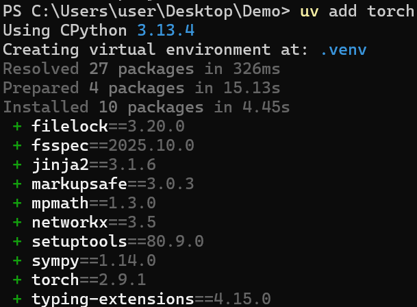
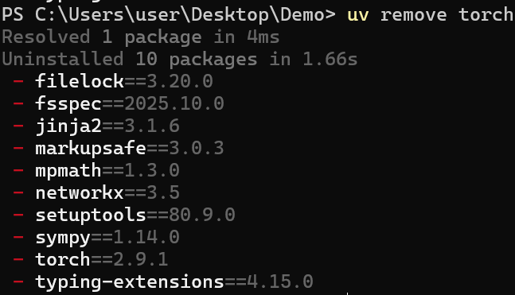
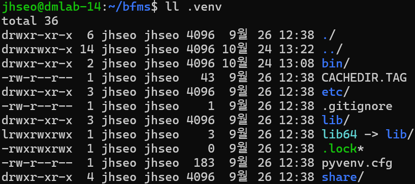
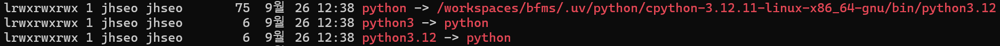

이 프로젝트는 [uv](https://docs.astral.sh/uv/)를 사용해 의존성을 관리합니다. uv는 여러 기능을 지원하지만, 기본적으로는 [pip](https://pip.pypa.io/en/stable/)과 [venv](https://docs.python.org/3/library/venv.html)를 합쳐 놓았다고 생각할 수 있습니다. [conda](https://anaconda.org/anaconda/conda)에 익숙하다면, conda와도 비슷한 면모가 있습니다.

uv를 사용하면,
- pip보다 10배-100배 빠르게 패키지 의존성을 해결할 수 있고,
- `requirements.txt`보다 정밀하게 패키지 의존성을 기재해, 재현 문제를 방지할 수 있습니다.
# 시작하기 전에
레포지터리를 Github에서 복제하고, [DevContainer](https://containers.dev/)에 접속했다면, 다음 명령어를 실행합니다.
```bash
uv sync
```
해당 명령어는 [pyproject.toml](https://packaging.python.org/en/latest/guides/writing-pyproject-toml/) 파일의 `dependencies`에 기재된 패키지를 설치하는 명령어입니다. 이후에도, 패키지 설정이 무언가 잘못된 것 같다고 느껴지면, 해당 명령어를 사용하면 됩니다.
# 패키지 설치
uv에서 패키지 설치는 다음 명령어를 통해 이루어집니다.
```bash
uv add <package name>
```
## 예시

예를 들어, PyTorch를 uv를 통해 설치한다고 가정합시다.
```bash
uv add torch
```
몇 분 후, 설치한 패키지 목록이 아래와 같이 출력됩니다.


이때, 두 파일에 추가적으로 변화가 발생합니다. 먼저, `pyproject.toml` 파일에 `torch`가 추가됩니다.
```toml
[project]
name = "demo"
version = "0.1.0"
description = "Add your description here"
readme = "README.md"
requires-python = ">=3.13"
dependencies = [
    "torch>=2.9.1",
]
```
이는 우리 프로젝트가 `torch` 2.9.1 이상 버전에 의존한다고 공개적으로 알리는 것입니다.

둘째로, `uv.lock` 파일에 `torch` 및 **torch를 설치할 때 함께 설치한 패키지**의 정보가 기재됩니다.
```toml
[[package]]
name = "torch"
version = "2.9.1"
source = { registry = "https://pypi.org/simple" }
dependencies = [
    { name = "filelock" },
    { name = "fsspec" },
    { name = "jinja2" },
    { name = "networkx" },
]
wheels = [
    { url = "https://files.pythonhosted.org/packages/20/60/8fc5e828d050bddfab469b3fe78e5ab9a7e53dda9c3bdc6a43d17ce99e63/torch-2.9.1-cp313-cp313-manylinux_2_28_aarch64.whl", hash = "sha256:c29455d2b910b98738131990394da3e50eea8291dfeb4b12de71ecf1fdeb21cb", size = 104135743, upload-time = "2025-11-12T15:21:34.936Z" },
]
...

[[package]]
name = "triton"
version = "3.5.1"
source = { registry = "https://pypi.org/simple" }
...
```

`pyproject.toml` 파일에는 패키지의 버전 정보만 기재된 반면, 락 파일에는 이에 더해 구체적으로 어떤 파일(wheel)을 설치했는지가 기재됩니다. 예를 들어, 위에 `wheels` 단락의 `url` 마지막을 살펴봅시다.
```
torch-2.9.1-cp313-cp313-manylinux_2_28_aarch64.whl
```
대시(-)로 구분된 각 항목은 다음을 뜻합니다.
- `torch`: 패키지 명
- `2.9.1`: 패키지 버전
- `cp313`: 패키지를 빌드[^1]할 때 사용한 파이썬 배포판(버전).
- [manylinux](https://github.com/pypa/manylinux): 타겟 운영체제. 이 경우, 다양한 리눅스 배포판.

즉, 락 파일은 보다 구체적으로 어떤 파일이 설치에 사용되었는지를 정확하게 기재합니다. 이를 통해, 추후 재설치시(`uv sync` 등을 통해) 발생할 수 있는 문제를 원천 차단하는 것이 목적입니다[^2].

중요한 사실 중 한가지는, 락 파일은 **사람이 읽도록 의도하지 않은** 파일이라는 점입니다. 위 설명은 개념 이해를 위한 설명일 뿐이며, 실제로 사용할 때는 두 파일을 직접 편집할 필요 없이, `uv add`를 사용하면 됩니다.
# 패키지 제거
패키지 제거는 다음 명령어로 이루어집니다.
```bash
uv remove <package name>
```
## 예시
방금 설치한 `torch`를 제거해봅시다.
```
uv remove torch
```
몇 초후, 삭제한 패키지 목록이 출력됩니다.


`pyproject.toml`와 `uv.lock` 파일에서도 관련 내용이 사라진 것을 확인할 수 있습니다.
```toml
[project]
name = "demo"
version = "0.1.0"
description = "Add your description here"
readme = "README.md"
requires-python = ">=3.13"
dependencies = []
```
(락파일은 그냥 빈 파일입니다.)
# 파이썬 실행
`uv`는 가상 환경을 사용해 프로젝트를 관리하기 때문에, 명령창에 그냥 `python`을 입력해서는 원하는 환경을 사용할 수 없습니다. 대신, 다음과 같은 명령어를 사용해야 합니다.
```bash
uv run python
```
마찬가지로, 어떤 파이썬 스크립트를 실행하기 위해서는(e.g. `main.py`), 다음과 같은 명령어를 실행해야 합니다.
```bash
uv run main.py
```
이는 `uv`로 설치한 파이썬 유틸리티를 실행할 때도 마찬가지입니다.
```
uv run wandb
```
## (Optional) 추가 사항
uv는 가상환경(virtual env)를 사용해 패키지를 관리합니다. 가상환경은 시스템 파이썬(`apt get`으로 설치한 파이썬)과 별개로, 개별 프로젝트 별로 설치한 파이썬을 뜻합니다. 보통, 가상환경은 `.venv` 폴더에 설치됩니다.

해당 폴더에서, 실제 파이썬 실행 파일은 `bin` 폴더에 위치합니다.

`wandb`, `uv` 등 파이썬 패키지로 배포된 유틸리티도 해당 폴더에 설치됩니다. 위 이미지를 보면, `python` 옆에 `->`로 다른 경로가 기재된 것을 볼 수 있습니다. 이는 Unix 기반 운영체제(리눅스)에서 제공하는 [symbolic link](https://en.wikipedia.org/wiki/Symbolic_link)라는 기능으로, 실제로 다른 위치에 존재하는 파일, 폴더 등을 현재 위치에서 사용할 수 있게 해줍니다. 윈도우의 바로가기 기능과 유사하다고 볼 수 있겠습니다.

위의 예시에서는, 실제로 파이썬이 설치된 경로는 `/workspaces/bfms/.../python3.12`입니다. `uv`가 프로젝트를 생성할 때(`uv init`), 가상환경을 생성하면서 파이썬도 함께 설치합니다. 이때, 파이썬을 설치하는 경로는 `UV_PYTHON_INSTALL_DIR` 환경 변수로 결정됩니다. 기본 경로는 `/home/<user>/.uv/python`입니다.

하지만, 우리는 DevContainer를 이용하고 있기 때문에, 기본 설정을 사용하면 실제로 사용자 폴더 대신 가상의 `/root/.uv/python`에 파이썬이 설치됩니다. 이 경우, DevContainer를 다시 시작할 때마다 파이썬을 새로 설치해야 하는 문제점이 있습니다. 따라서, 우리 프로젝트에서는 `devcontainer.json` 파일에서 다른 경로로 파이썬 설치 폴더를 지정하였습니다.
```json
{
  "containerEnv": {
    "UV_PYTHON_INSTALL_DIR": "${containerWorkspaceFolder}/.uv/python",
    "UV_PYTHON_BIN_DIR": "${containerWorkspaceFolder}/.uv/bin",
    "UV_TOOL_DIR": "${containerWorkspaceFolder}/.uv/tools",
    "UV_TOOL_BIN_DIR": "${containerWorkspaceFolder}/.uv/bin"
  },
}
```
이 경우, 프로젝트 폴더 아래의 `.uv/python`에 파이썬을 설치합니다. 해당 폴더는 시스템에서 마운트한 폴더기 때문에, DevContainer를 재시작할 때 파이썬을 재설치할 필요가 없습니다. 나머지 환경 변수도 비슷한 역할을 수행합니다.

[^1]: 소스코드를 휠 파일로.
[^2]: `requirements.txt`를 `pip install -r` 등으로 설치할 때 문제를 겪은 경험이 한번씩 있으리라 믿습니다.
